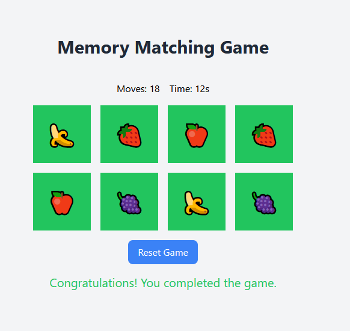

# React - Memory Matching Game

# 🔗 [Live Preview](https://charming-kitten-2c05c4.netlify.app/)

This is a simple memory matching game built with React and Vite. The game involves flipping cards to find matching pairs. The game tracks the number of moves and the time taken to complete the game.

## Features

- Flip cards to find matching pairs
- Track the number of moves
- Track the time taken to complete the game
- Reset the game to play again
- Responsive design using Tailwind CSS

## Installation

1. Clone the repository:

`git clone https://github.com/your-username/memory-game.git`

`cd memory-game`

2. Install the dependencies:

`npm install`

1. Start the development server:

`npm run dev`
